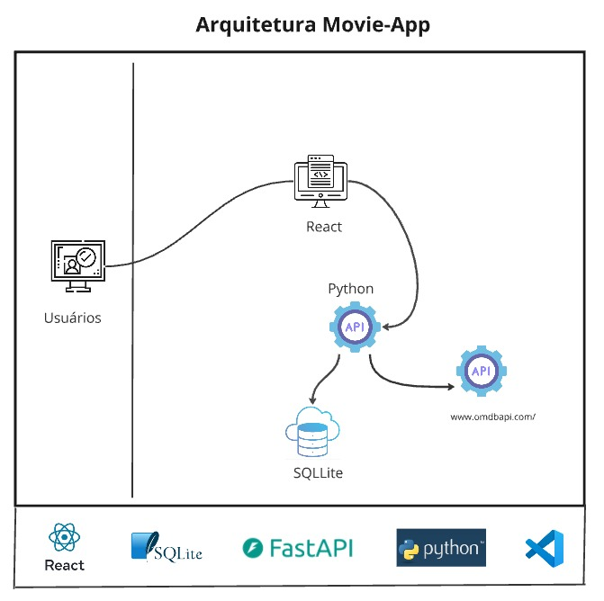

Este é um projeto que faz parte do material didático da disciplina Desenvolvimento Front-end Avançado

É o desenvolvimento de uma single page application (SPA) consumindo o dado de uma API.
-

O projeto está no github em repositório público e possui 2 sub pastas client onde se encontra o frontend React e move-api onde esta o projeto backend em Python:

git clone https://github.com/EduardoZava/devfull-mvp3.git

Respectivamente em cada subpsta existe os README com explicações de como executar cada submódulo do projeto.

